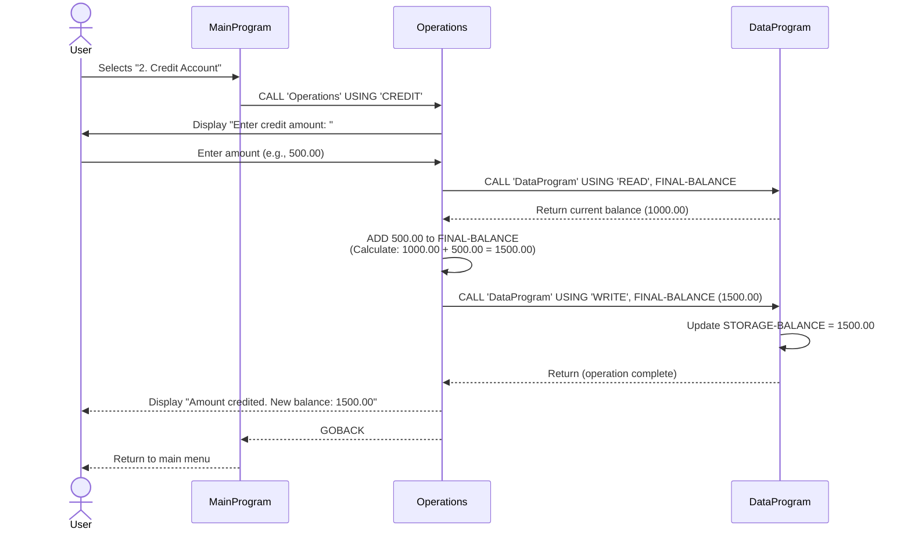

# Lab 4 - Account Management System Documentation

## Overview
This COBOL-based Account Management System provides a menu-driven interface for managing student accounts. The system maintains account balances and supports credit, debit, and balance inquiry operations.

---

## Program Structure

### 1. **MainProgram** (`main.cob`)
**Purpose:** Primary user interface and menu orchestrator

**Key Functions:**
- Displays an interactive menu with four options
- Accepts user input (1-4) for menu selection
- Routes user requests to the appropriate operations
- Continues until user selects Exit (option 4)

**Menu Options:**
| Option | Operation | Handler |
|--------|-----------|---------|
| 1 | View Balance | Calls Operations with 'TOTAL' |
| 2 | Credit Account | Calls Operations with 'CREDIT' |
| 3 | Debit Account | Calls Operations with 'DEBIT' |
| 4 | Exit | Terminates the program |

---

### 2. **Operations** (`operations.cob`)
**Purpose:** Business logic layer for account operations

**Key Functions:**
- Processes three types of operations: TOTAL, CREDIT, and DEBIT
- Orchestrates communication between the menu system and data layer
- Handles user input for transaction amounts

**Operations Detail:**

| Operation | Behavior |
|-----------|----------|
| **TOTAL** | Reads current balance from DataProgram and displays it to the user |
| **CREDIT** | Prompts user for amount → reads current balance → adds amount → writes updated balance → displays new balance |
| **DEBIT** | Prompts user for amount → reads current balance → validates funds → subtracts amount (if funds sufficient) → writes updated balance or displays insufficient funds error |

---

### 3. **DataProgram** (`data.cob`)
**Purpose:** Data persistence and storage layer

**Key Functions:**
- Maintains STORAGE-BALANCE variable as the single source of truth for account data
- Supports two operations via LINKAGE SECTION: READ and WRITE
- READ: Retrieves current balance from STORAGE-BALANCE
- WRITE: Updates STORAGE-BALANCE with new value

**Initial Balance:** $1,000.00 (1000.00 with 2 decimal places)

---

## Business Rules

### Account Rules
1. **Initial Balance:** All accounts start with a balance of $1,000.00
2. **Precision:** Balances are stored with 2 decimal places (currency format)
3. **Balance Inquiry:** Users can view their current balance at any time without restrictions
4. **Credit Operations:** Users may add funds to their account in any amount
5. **Debit Operations:** Users may only withdraw funds if the account has sufficient balance
   - If attempted debit exceeds available balance, the operation is rejected with an error message
   - Overdraft protection prevents negative balances

### Data Integrity
- The DataProgram serves as the single authority for balance storage
- All balance modifications must go through the DataProgram WRITE operation
- Balance reads must come from the DataProgram READ operation

### User Experience
- Menu-driven interface for accessibility
- Clear prompts for user input
- Immediate feedback on transaction status (success/failure)
- Option to exit at any time

---

## Data Types

| Variable | Type | Format | Purpose |
|----------|------|--------|---------|
| STORAGE-BALANCE | PIC 9(6)V99 | Numeric with 2 decimals | Stores account balance |
| OPERATION-TYPE | PIC X(6) | Character (6 bytes) | Operation identifier |
| AMOUNT | PIC 9(6)V99 | Numeric with 2 decimals | Transaction amount |
| USER-CHOICE | PIC 9 | Single digit | Menu selection |
| CONTINUE-FLAG | PIC X(3) | Character ("YES"/"NO") | Loop control flag |

---

## Call Flow Diagram

```
MainProgram (Menu Interface)
    ↓
    → ACCEPT User Choice
    ↓
    ├─→ Choice 1 (View Balance)
    │       ↓
    │       CALL Operations 'TOTAL'
    │           ↓
    │           CALL DataProgram 'READ'
    │           DISPLAY Balance
    │
    ├─→ Choice 2 (Credit)
    │       ↓
    │       CALL Operations 'CREDIT'
    │           ↓
    │           CALL DataProgram 'READ'
    │           ADD Amount
    │           CALL DataProgram 'WRITE'
    │           DISPLAY New Balance
    │
    ├─→ Choice 3 (Debit)
    │       ↓
    │       CALL Operations 'DEBIT'
    │           ↓
    │           CALL DataProgram 'READ'
    │           IF Balance >= Amount
    │               SUBTRACT Amount
    │               CALL DataProgram 'WRITE'
    │               DISPLAY New Balance
    │           ELSE
    │               DISPLAY "Insufficient funds" Error
    │
    └─→ Choice 4 (Exit)
            ↓
            STOP RUN
```

---

## Technical Notes

- **Language:** COBOL
- **Architecture:** Three-tier (Presentation → Business Logic → Data)
- **Error Handling:** Basic validation for insufficient funds during debit operations
- **State Management:** Account balance persists during program execution (resets on program restart)

---

## Data Flow Sequence Diagram

The following diagram illustrates the complete data flow for a **Credit Operation** (the most comprehensive transaction flow):



### Data Flow Summary

#### View Balance (Operation 'TOTAL')
1. User selects option 1 → MainProgram calls Operations
2. Operations calls DataProgram READ → receives current balance
3. Operations displays balance to user → MainProgram returns to menu

#### Credit Operation (Operation 'CREDIT')
1. User selects option 2 → MainProgram calls Operations
2. Operations prompts for amount → User enters amount
3. Operations calls DataProgram READ → receives current balance
4. Operations calculates new balance = current + amount
5. Operations calls DataProgram WRITE → updates STORAGE-BALANCE
6. Operations displays new balance → MainProgram returns to menu

#### Debit Operation (Operation 'DEBIT')
1. User selects option 3 → MainProgram calls Operations
2. Operations prompts for amount → User enters amount
3. Operations calls DataProgram READ → receives current balance
4. Operations validates: IF balance ≥ amount THEN
   - Calculates new balance = current - amount
   - Calls DataProgram WRITE → updates STORAGE-BALANCE
   - Displays new balance
5. ELSE displays "Insufficient funds" error
6. MainProgram returns to menu

### Key Data Elements in Flow

| Element | Format | Owner | Usage |
|---------|--------|-------|-------|
| STORAGE-BALANCE | PIC 9(6)V99 | DataProgram | Single source of truth for account balance |
| FINAL-BALANCE | PIC 9(6)V99 | Operations | Working variable for current balance during operations |
| AMOUNT | PIC 9(6)V99 | Operations | Holds user-entered transaction amount |
| OPERATION-TYPE | PIC X(6) | Operations | Determines operation behavior (TOTAL/CREDIT/DEBIT) |

---

## Execution Flow Summary

The application follows a **request-response model** with layered separation of concerns:

1. **Presentation Layer (MainProgram):** Accepts user input and routes to business logic
2. **Business Logic Layer (Operations):** Processes transactions and implements validation rules
3. **Data Access Layer (DataProgram):** Manages persistent account balance storage

All data modifications flow through DataProgram to ensure consistency and integrity of the account balance.
